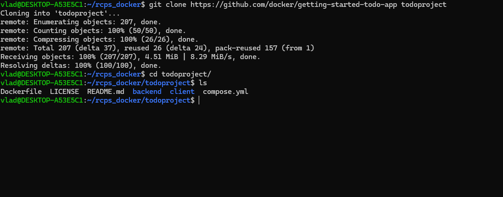
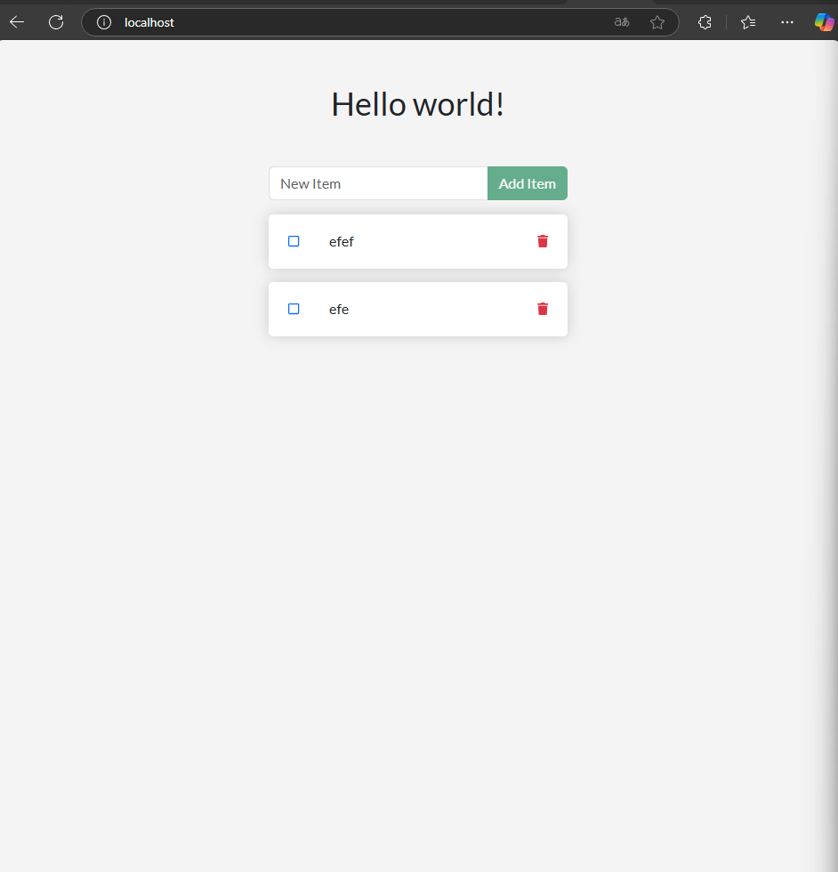
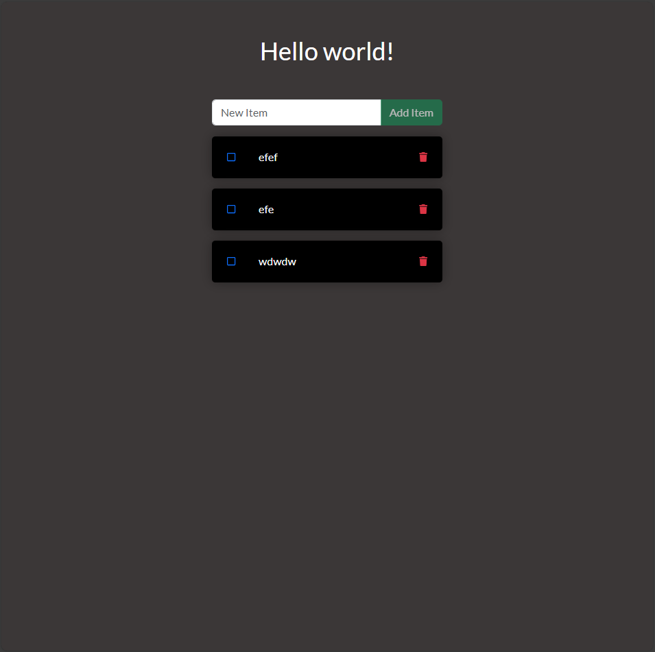
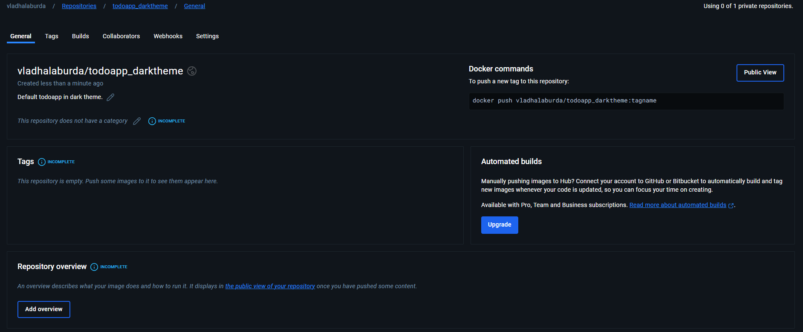
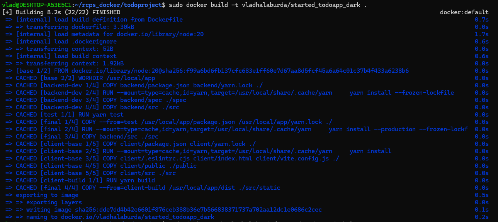
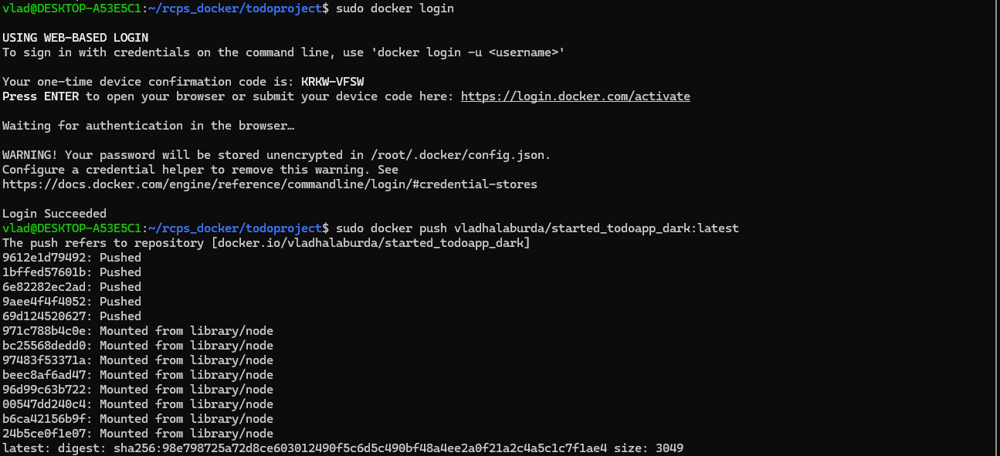

# Docker

1. Для перевірки працездатності докеру підіймемо образ welcome-to-docker
```bash
docker run -d -p 8080:80 docker/welcome-to-docker
```
Після чого відкриємо у браузері localhost:8080 та побачимо успіх до підняття цього образу.
[screen](screens/docker1.png)

2. Для того щоб перевірити можливість підняття проектів за допомогою docker compose, завантажуймо проект з оф.сайту докер

```bash
	git clone https://github.com/docker/getting-started-todo-app todoproject
```


3. Потім треба запустити контейнери за допомогою команди
```bash
	docker compose watch
```
команда підняття усіх контейнерів які було зазначено у docker-compose.yaml файлі, та з можливостю автоматичного перезавантажання, дуже удобно при розробці.
4. Перевіряємо чи працює проект

5. Вносимо зміни у проект, я відреагував стилі, та зробив чорну тему додатка.

6. Потім я вирішив виставити свій модифікований образ до DockerHub, після авторизації я створив новий публічний репозиторій.

7. Образу в нас ще немає, збераємо його, за допомогою команди
```bash
docker build -t
```

8. Потім потрібно авторизуватись з CLI у DockerHub, вводимо команду ```docker login```
9. Переходимо по посилання підтверджуємо авторизацію
10. Потім вже заливаємо наш образ за допомогою команди ```docker push```


